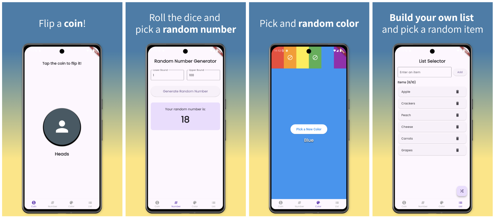
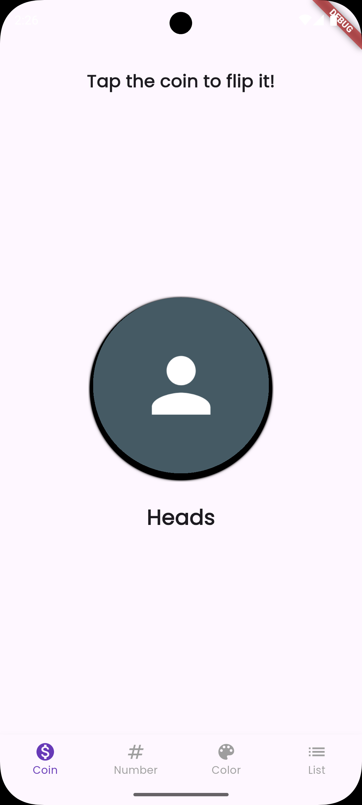
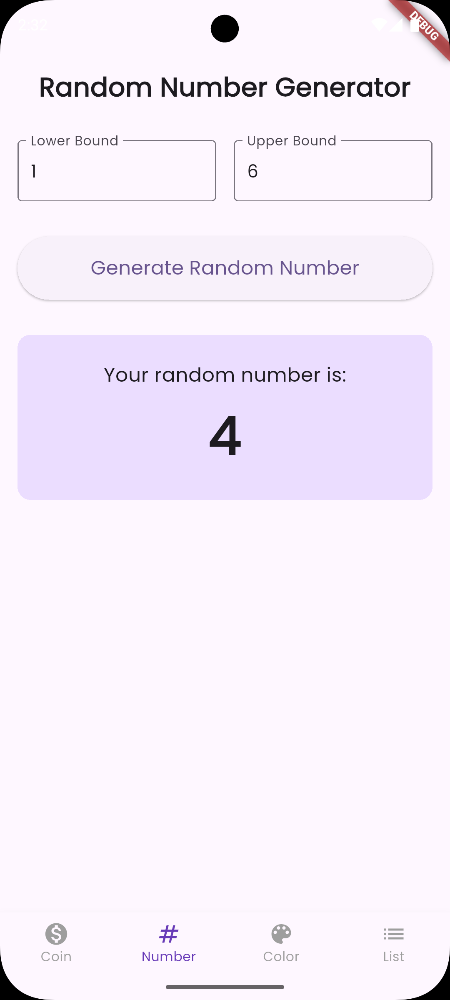
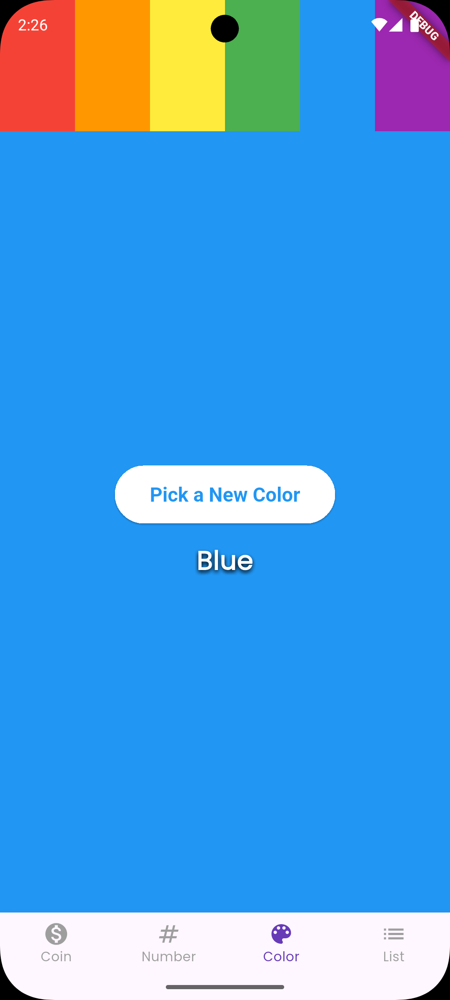
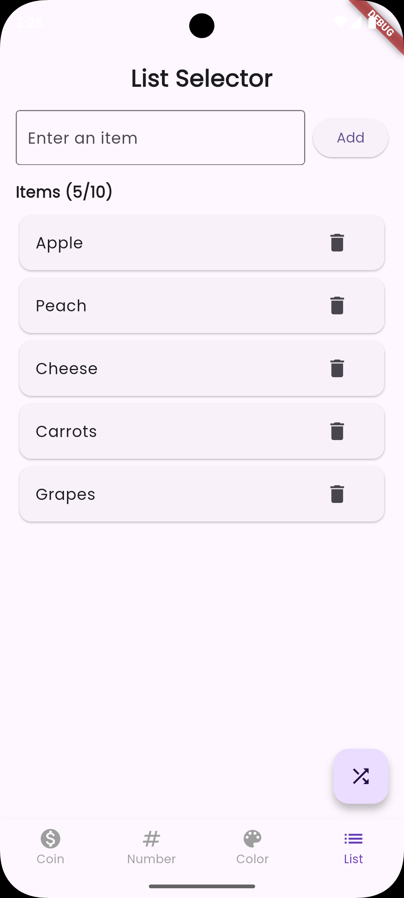

# QuikPik

> A multi-purpose randomness generator app for quick decisions and random outcomes

[](https://flutter.dev)
[](https://dart.dev)
[](https://opensource.org/licenses/MIT)

QuikPik is a cross-platform mobile and web application that provides four essential randomness-generation utilities in one sleek, Material Design 3 interface. Whether you need to flip a coin, generate a random number, pick a color, or select an item from a list, QuikPik makes it quick and easy.

## Features

QuikPik includes four powerful randomness generators accessible through an intuitive bottom navigation bar:

### 🪙 Coin Flip
- Tap to flip a virtual coin with realistic animation
- 10-flip animation sequence with smooth 3D rotation
- 50/50 probability for Heads or Tails
- Large, easy-to-see result display

### 🎲 Random Number Generator
- Generate random integers within custom bounds
- Editable lower and upper limits with validation
- Persistent settings saved across sessions
- Perfect for dice rolls, lottery numbers, or any numeric randomization

### 🎨 Random Color Generator
- Generate random colors from a customizable palette
- Choose from 6 vibrant colors: Red, Orange, Yellow, Green, Blue, Purple
- Smooth color transition animations
- Full-screen color display for maximum impact
- Save your color preferences

### 📋 List Item Selector
- Create custom lists with up to 10 items
- Add and delete items easily
- Random selection with fair distribution
- Perfect for choosing dinner options, team assignments, or any decision-making
- Lists are saved automatically

## Screenshots



<details>
<summary>View Individual Screenshots</summary>

| Coin Flip | Number Generator | Color Generator | List Selector |
|-----------|------------------|-----------------|---------------|
|  |  |  |  |

</details>

## Technology Stack

- **Framework:** [Flutter](https://flutter.dev) - Cross-platform UI toolkit
- **Language:** [Dart](https://dart.dev) ^3.7.2
- **Design:** Material Design 3
- **Platform Support:** Android, iOS, Web

### Key Dependencies

- `shared_preferences` ^2.2.2 - Local data persistence
- `flutter_animate` ^4.5.0 - Smooth animations
- `google_fonts` ^6.1.0 - Poppins typography
- `provider` ^6.1.1 - State management support

## Getting Started

### Prerequisites

- [Flutter SDK](https://flutter.dev/docs/get-started/install) (stable channel)
- Dart SDK ^3.7.2 (comes with Flutter)
- For mobile development:
  - Android Studio (for Android builds)
  - Xcode (for iOS builds, macOS only)
- For web development: Chrome browser

### Installation

1. **Clone the repository**
   ```bash
   git clone https://github.com/bluestemso/quikpik_app.git
   cd quikpik_app
   ```

2. **Install dependencies**
   ```bash
   flutter pub get
   ```

3. **Verify Flutter setup**
   ```bash
   flutter doctor
   ```

4. **Run the app**
   ```bash
   # On connected device/emulator
   flutter run

   # On specific platform
   flutter run -d chrome        # Web
   flutter run -d android       # Android
   flutter run -d ios          # iOS (macOS only)
   ```

## Building for Production

### Android

```bash
# Build APK
flutter build apk

# Build App Bundle (for Google Play Store)
flutter build appbundle
```

Output: `build/app/outputs/flutter-apk/app-release.apk`

### iOS (macOS only)

```bash
flutter build ios
```

Open `ios/Runner.xcworkspace` in Xcode to archive and distribute.

### Web

```bash
flutter build web
```

Output: `build/web/` (deploy to any web server)

## Project Structure

```
lib/
├── main.dart                     # App entry point, theme, navigation
└── screens/                      # Feature screens
    ├── coin_flip_screen.dart     # Coin flip functionality
    ├── random_number_screen.dart # Number generator
    ├── random_color_screen.dart  # Color generator
    └── list_selector_screen.dart # List item selector

assets/
└── images/                       # Screenshots and graphics

test/
└── widget_test.dart              # Widget tests
```

## Development

### Running Tests

```bash
# Run all tests
flutter test

# Run with coverage
flutter test --coverage
```

### Code Style

This project follows Flutter's recommended lints:

```bash
# Analyze code
flutter analyze
```

Configuration: `analysis_options.yaml` includes `flutter_lints: ^5.0.0`

### Debugging

```bash
# Run in debug mode with hot reload
flutter run

# Run in profile mode (performance profiling)
flutter run --profile

# Run in release mode
flutter run --release
```

## Features in Detail

### Data Persistence

QuikPik automatically saves your preferences using SharedPreferences:
- Number generator bounds are saved between sessions
- Color selection preferences persist
- List items are stored locally
- No account or cloud sync required - all data stays on your device

### Animations

- Coin flip: 1000ms animation with 10 rotation cycles
- Color transitions: 500ms smooth AnimatedContainer transitions
- Material Design motion guidelines throughout

### Input Validation

- Number generator validates numeric input and bound relationships
- Color generator ensures at least one color is selected
- List selector enforces 10-item maximum
- User-friendly error messages via SnackBars

## Version History

**1.0.1+2** (Current Release)
- Added screenshots to assets
- Updated list selector focus behavior
- Optimized Gradle configuration for release
- Production-ready release

See full commit history for detailed changes.

## Contributing

Contributions are welcome! Please feel free to submit a Pull Request. For major changes, please open an issue first to discuss what you would like to change.

1. Fork the repository
2. Create your feature branch (`git checkout -b feature/AmazingFeature`)
3. Commit your changes (`git commit -m 'Add some AmazingFeature'`)
4. Push to the branch (`git push origin feature/AmazingFeature`)
5. Open a Pull Request

## License

This project is licensed under the MIT License - see the [LICENSE](LICENSE) file for details.

```
MIT License

Copyright (c) 2025 taylor learns machines

Permission is hereby granted, free of charge, to any person obtaining a copy
of this software and associated documentation files (the "Software"), to deal
in the Software without restriction, including without limitation the rights
to use, copy, modify, merge, publish, distribute, sublicense, and/or sell
copies of the Software, and to permit persons to whom the Software is
furnished to do so, subject to the following conditions:

The above copyright notice and this permission notice shall be included in all
copies or substantial portions of the Software.
```

## Acknowledgments

- Built with [Flutter](https://flutter.dev) and [Dart](https://dart.dev)
- Icons generated with [Icon Kitchen](https://icon.kitchen)
- Typography by [Google Fonts](https://fonts.google.com/specimen/Poppins) (Poppins)
- Follows [Material Design 3](https://m3.material.io) guidelines

## Support

If you encounter any issues or have questions:
- Open an [issue](https://github.com/bluestemso/quikpik_app/issues)
- Check the [CLAUDE.md](CLAUDE.md) file for detailed technical documentation

## Author

**taylor learns machines**

- GitHub: [@bluestemso](https://github.com/bluestemso)

---

Made with Flutter 💙
